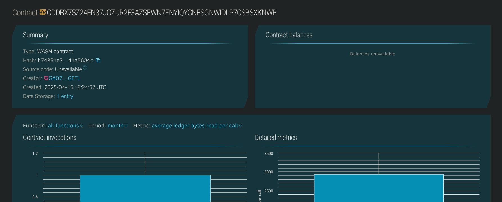

# Blockchain Explorer Lite

## Project Description
A lightweight, on-chain blockchain explorer smart contract that logs and tracks basic transaction records such as sender, receiver, amount, and an optional message on the Stellar blockchain using Soroban SDK.

## Project Vision
To provide developers and users with a transparent, trustless record of interactions within a dApp or blockchain system, enabling easier debugging and auditability with a minimal footprint.

## Key Features
- 📦 **Log Transactions:** Store sender, receiver, amount, and custom message.
- 🔍 **View Specific Transaction:** Fetch any transaction by its unique ID.
- 📊 **Total Count:** Get the number of transactions recorded.

## Future Scope
- 📁 Add filtering options (e.g., by address).
- 🔐 Add role-based access to sensitive metadata.
- 🌍 Enable indexing and search by time or message.
- 📈 Connect to a frontend to display transaction history visually.

## Contract Details
CDDBX7SZ24EN37JOZUR2F3AZSFWN7ENYIQYCNFSGNWIDLP7CSBSXKNWB
